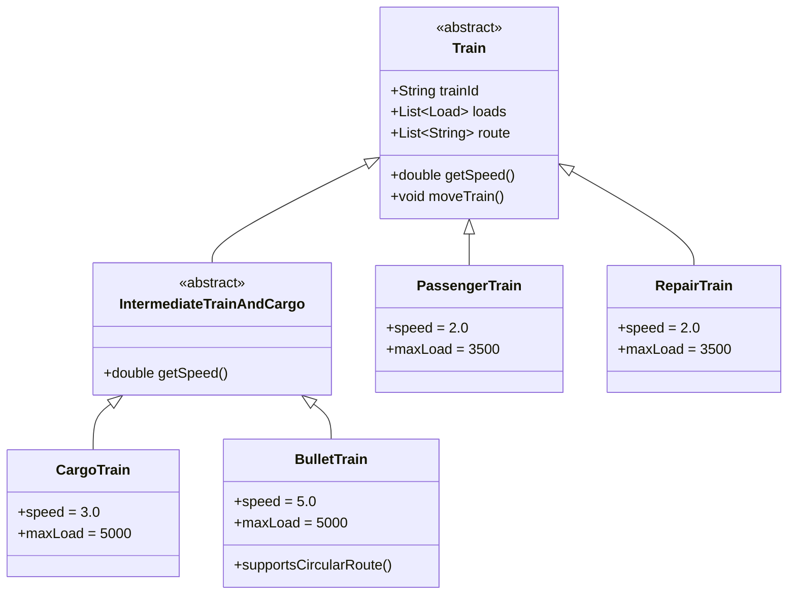
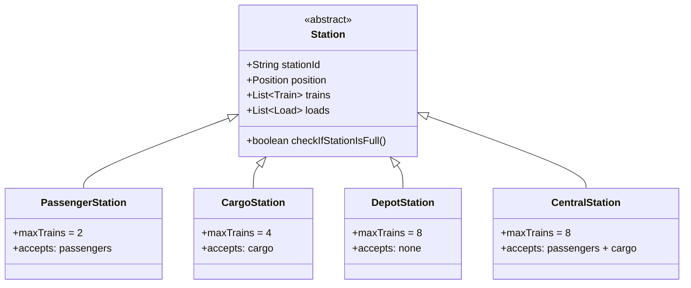
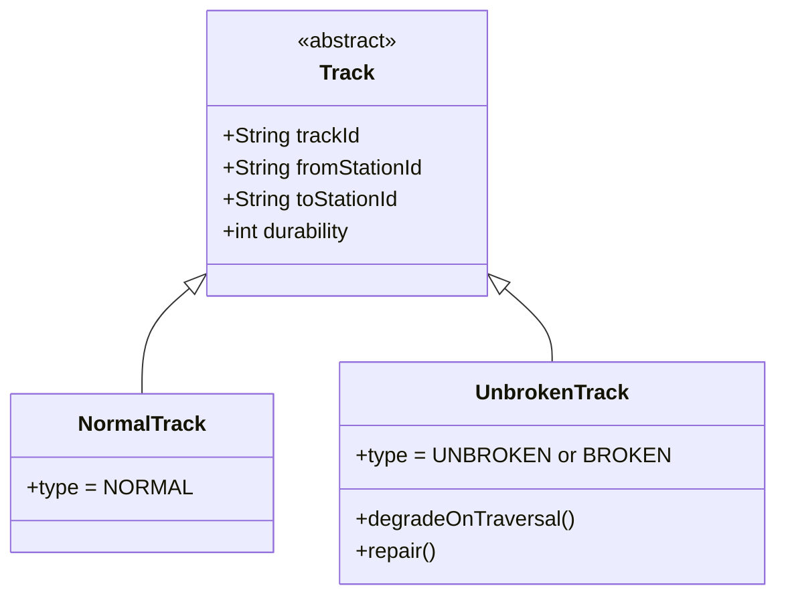
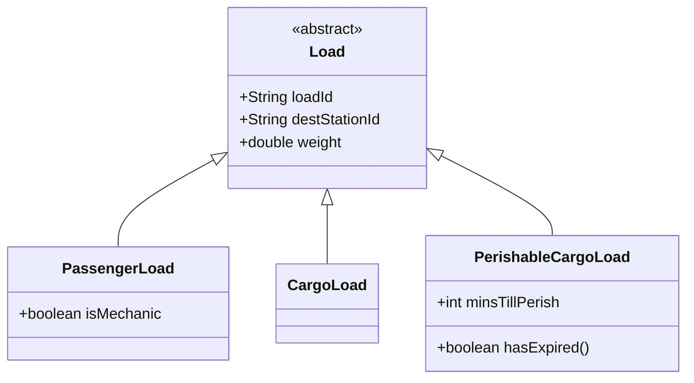

# Trains Controller

<div align="center">


A railway network simulation system built in Java for UNSW's Object-Oriented Design and Programming course (COMP2511). Models a realistic train network with stations, tracks, trains, and cargo/passenger loads, simulated over discrete time ticks via a REST API backend.

</div>

---

## Table of Contents

- [Project Overview](#project-overview)
- [Architecture](#architecture)
- [OOP Concepts Demonstrated](#oop-concepts-demonstrated)
- [Class Hierarchies](#class-hierarchies)
- [Key Features](#key-features)
- [Technology Stack](#technology-stack)
- [Getting Started](#getting-started)
- [Running Tests](#running-tests)
- [API Reference](#api-reference)

---

## Project Overview

The system simulates a train network where:

- **Stations** of different types host trains and waiting loads
- **Tracks** connect stations and degrade in durability as trains traverse them
- **Trains** of different types follow assigned routes, carrying passengers and cargo
- **Loads** (passengers and cargo) board trains at stations and disembark at their destinations
- A **simulation engine** advances the network state tick by tick

The application exposes a REST API (Spark Framework) and serves a web-based visualizer.

---

## Architecture

```
unsw/
├── App.java                        # REST API entry point (Spark Framework)
├── trains/
│   ├── TrainsController.java       # Central controller - manages all entities
│   ├── Trains/
│   │   ├── Train.java              # Abstract base class
│   │   ├── IntermediateTrainAndCargo.java  # Abstract intermediate class
│   │   ├── PassengerTrain.java
│   │   ├── CargoTrain.java
│   │   ├── BulletTrain.java
│   │   └── RepairTrain.java
│   ├── Stations/
│   │   ├── Station.java            # Abstract base class
│   │   ├── PassengerStation.java
│   │   ├── CargoStation.java
│   │   ├── DepotStation.java
│   │   └── CentralStation.java
│   ├── Tracks/
│   │   ├── Track.java              # Abstract base class
│   │   ├── NormalTrack.java
│   │   └── UnbrokenTrack.java
│   └── Loads/
│       ├── Load.java               # Abstract base class
│       ├── PassengerLoad.java
│       ├── CargoLoad.java
│       └── PerishableCargoLoad.java
├── exceptions/
│   ├── UNSWException.java
│   └── InvalidRouteException.java
├── response/models/                # DTOs for API responses
│   ├── TrainInfoResponse.java
│   ├── StationInfoResponse.java
│   ├── TrackInfoResponse.java
│   └── LoadInfoResponse.java
└── utils/
    ├── Position.java
    └── TrackType.java              # Enum: NORMAL, UNBROKEN, BROKEN
```

---

## OOP Concepts Demonstrated

### 1. Inheritance

Four independent class hierarchies, each with a meaningful abstract base class:

- `Load` -> `PassengerLoad`, `CargoLoad`, `PerishableCargoLoad`
- `Station` -> `PassengerStation`, `CargoStation`, `DepotStation`, `CentralStation`
- `Track` -> `NormalTrack`, `UnbrokenTrack`
- `Train` -> `PassengerTrain`, `RepairTrain`, `IntermediateTrainAndCargo` -> `CargoTrain`, `BulletTrain`

Each subclass inherits shared behaviour from its base and overrides only what differs, avoiding code duplication.

### 2. Abstraction

Abstract base classes define the contract for each domain concept without exposing internal complexity:

- `Train` defines routing, movement, and load-management behaviour. Concrete train types only configure their own capacity, speed, and allowed load types.
- `Station` defines docking, embarking, and disembarking rules. Concrete stations set their own capacity limits and accepted load types.
- `Load` defines identity, destination, and weight. Concrete loads add type-specific properties (e.g. expiry timer).

### 3. Encapsulation

All domain objects use **private fields with controlled public access**:

- Internal state (load lists, train positions, durability values) is not directly accessible from outside the class.
- Complex logic such as `moveTrain()`, `simulateLoadEmbark()`, and `repairTrack()` is encapsulated within the relevant class, hiding implementation details from callers.
- `TrainsController` acts as the sole public facade; external code interacts only through its API, never directly with internal collections.

### 4. Polymorphism

**Method overriding** is used to specialise behaviour across the train hierarchy:

- `IntermediateTrainAndCargo` overrides `getSpeed()` to apply a cargo-weight penalty:
  ```
  effectiveSpeed = baseSpeed * (1 - cargoWeight * 0.0001)
  ```
  `PassengerTrain` and `RepairTrain` inherit the default speed with no penalty.

**Runtime polymorphism** allows the simulation engine to operate on base types while invoking the correct subclass behaviour:

- Trains stored as `Train` references call subclass-specific speed and capacity logic.
- Stations stored as `Station` references enforce subclass-specific docking and load-acceptance rules.
- `instanceof` checks are used deliberately only where load-type-specific handling is required (e.g. perishable cargo expiry check before embarking).

### 5. Composition

Domain objects are composed of other domain objects, modelling real-world "has-a" relationships:

- `Train` has a `List<Load>` (current cargo/passengers)
- `Station` has a `List<Train>` (docked trains) and `List<Load>` (waiting loads)
- `TrainsController` owns `HashMap`s of all stations, tracks, and trains
- All spatial entities hold a `Position` object

### 6. Custom Exception Hierarchy

```
Exception
└── UNSWException
    └── InvalidRouteException
```

Domain-specific exceptions provide meaningful error messages without leaking implementation internals to API callers.

### 7. Factory Pattern

`TrainsController` implements factory logic for creating domain objects based on a type string:

```java
// Station factory
switch (type) {
    case "PassengerStation" -> new PassengerStation(stationId, x, y);
    case "CargoStation"     -> new CargoStation(stationId, x, y);
    case "CentralStation"   -> new CentralStation(stationId, x, y);
    case "DepotStation"     -> new DepotStation(stationId, x, y);
}
```

Callers never reference concrete constructors, so new types can be added without changing the calling code.

### 8. Data Transfer Objects (DTOs)

Response model classes (`TrainInfoResponse`, `StationInfoResponse`, etc.) decouple the internal domain model from the external API contract. Domain objects are never serialised directly; they produce immutable response objects on demand.

---

## Class Hierarchies

### Trains



### Stations



### Tracks



### Loads



---

## Key Features

### Train Movement Simulation

Each simulation tick, `moveTrain()` executes the following logic:

1. Check if the destination station has capacity
2. If docked: embark eligible loads, depart
3. Move along the track toward the next station
4. On arrival: disembark loads for this destination, dock at station
5. Handle broken tracks; only `RepairTrain` may traverse, others wait
6. On departure from a station: apply durability damage to `UnbrokenTrack`

### Track Durability System

`UnbrokenTrack` has a durability value (0-10):

- Degrades by `1 + ceil(trainWeight / 1000)` per traversal
- Becomes `BROKEN` at 0; no trains may cross
- `RepairTrain` restores durability: `+1 + (2 x mechanicsOnBoard)` per repair tick

### Perishable Cargo Logic

Before a `PerishableCargoLoad` is embarked, the system calculates whether it will reach its destination before expiring. If not, it is left on the platform and eventually discarded.

### Route Validation

- Routes are validated on assignment; an `InvalidRouteException` is thrown for non-existent connections
- `BulletTrain` is the only train type permitted to have circular routes (first and last station connected by a track)
- All other trains reverse direction at route endpoints

---

## Technology Stack

| Component | Technology |
|-----------|------------|
| Language | Java 17 |
| Build Tool | Gradle 8.8 |
| REST Framework | Spark Java 2.9.3 |
| JSON | Gson 2.8.9 |
| Testing | JUnit Jupiter 5.9.3 |
| Linting | Checkstyle |
| Coverage | JaCoCo |

---

## Getting Started

### Prerequisites

- Java 17+
- Gradle (or use the included wrapper)

### Build

```bash
cd trains-controller
./gradlew build
```

### Run

```bash
./gradlew run
```

The server starts at `http://localhost:8080`. Open `index.html` in the browser for the visual simulation interface.

### Lint

```bash
./gradlew lint
```

### Coverage Report

```bash
./gradlew coverage
```

---

## Running Tests

```bash
./gradlew test
```

Tests are organised into:

| File | Coverage |
|------|----------|
| `TaskAExampleTests.java` | Station, track, and train creation; route validation |
| `TaskBExampleTests.java` | Load embarking, disembarking, and basic simulation |
| `MyTests.java` | Custom edge-case tests |
| `TestHelpers.java` | Shared test utilities |

---

## API Reference

| Method | Endpoint | Description |
|--------|----------|-------------|
| POST | `/api/station/create` | Create a station |
| GET | `/api/station/info` | Get station state |
| POST | `/api/train/create` | Create a train |
| POST | `/api/train/route` | Assign a route |
| GET | `/api/train/info` | Get train state |
| POST | `/api/track/create` | Create a track |
| GET | `/api/track/info` | Get track state |
| POST | `/api/cargo/create` | Add cargo load |
| POST | `/api/passenger/create` | Add passenger load |
| POST | `/api/simulate` | Advance simulation by N ticks |
